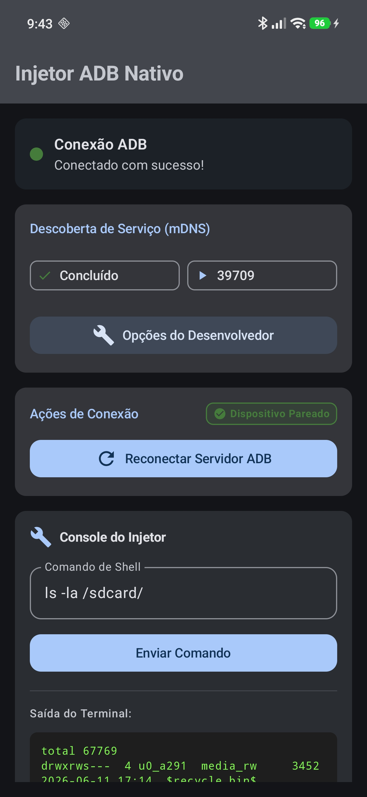
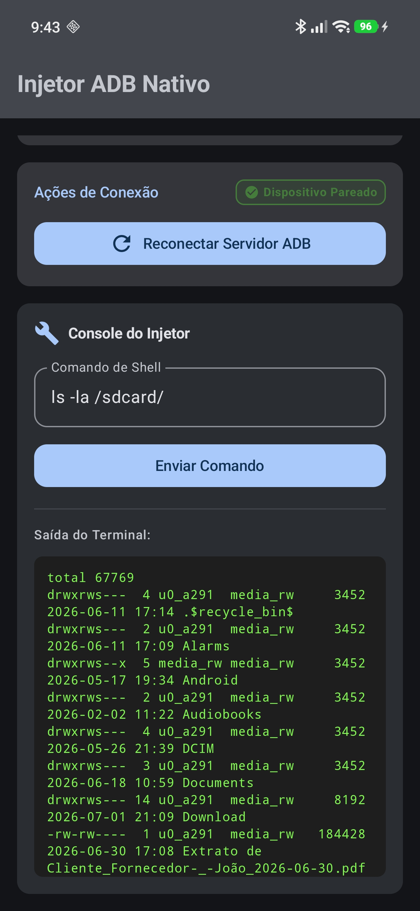

# Native ADB Injector

Um injetor ADB nativo para Android feito em Jetpack Compose. Ele descobre a Depuração por Wi-Fi na rede local via mDNS, pareia o dispositivo e roda comandos shell direto do celular, sem precisar de PC.

  
  

---

## 💡 Inspirado no Shizuku (Mas sem complicação)

O projeto foi inspirado no Shizuku, mas funciona de um jeito diferente:
* **Sem app intermediário:** O Shizuku exige um aplicativo gerenciador central rodando no fundo para dar permissão aos outros. Este aqui é 100% independente.
* **Autônomo:** Ele já vem com o próprio binário do ADB (`libadb.so`) embutido. Ele é o servidor e o cliente ao mesmo tempo.
* **Auto-Connect:** Ativou a Depuração por Wi-Fi nas configurações do Android? O app acha a porta sozinho via mDNS e já conecta no background, sem você precisar clicar em nada.

---

## 🚀 O que ele faz?

* **Acha a porta sozinho (mDNS):** Usa o `NsdManager` do Android para descobrir as portas de pareamento e conexão na sua rede local automaticamente.
* **Conexão Automática:** Se o celular já foi pareado uma vez, o app conecta sozinho sempre que você abrir ou ativar a depuração.
* **Pareamento por Notificação:** Quando o app detecta um pedido de pareamento, ele manda uma notificação. Você digita o código de 6 dígitos direto na barra de notificação do Android e pronto.
* **Console com Scroll:** Console integrado com rolagem para você mandar os comandos e ver o resultado na hora.

---

## 🛠️ Como funciona por dentro?

1. O app extrai o arquivo `libadb.so` para a pasta privada do sistema e dá permissão para rodar.
2. Ele fica ouvindo a rede procurando os serviços `_adb-tls-pairing._tcp` e `_adb-tls-connect._tcp`.
3. No primeiro pareamento, as chaves de segurança geradas ficam salvas na pasta `.android/` do app.
4. Nas próximas vezes, ele usa essas chaves guardadas para autenticar e conectar direto.

---

## ⚙️ Requisitos

* Android 11 (API 30) ou superior (obrigatório para ter a Depuração por Wi-Fi nativa).